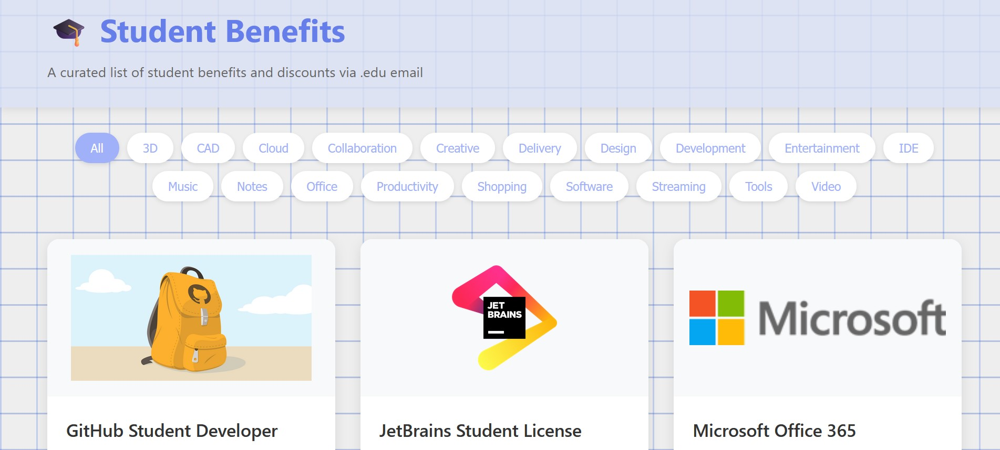

# 🎓 Student Benefits

A curated list of student benefits and discounts via .edu email. 

## Benefits as a website
Access it here: [studentbenefits.qzz.io](https://studentbenefits.qzz.io).



## Benefits as a list

<details>
<summary>List of Student Benefits</summary>

- GitHub Student Developer Pack
  - GitHub Copilot Pro
  - JetBrains IDEs
  - AppWrite Pro
- Notion Education Plus
- Figma Pro
- AutoDesk Suite
- Cursor Pro
- GitHub Copilot Pro
- Office 365
- ...
</details>

## Adding New Benefits

Do you know a benefit that is missing in the list? Open a GitHub issue or simply edit `benefits.json` and make a pull request. Each benefit has the following structure:

```json
{
  "title": "Service Name",
  "description": "Description of the student benefit",
  "imageSrc": "URL to the service logo/image",
  "tags": ["Category1", "Category2"]
}
```

## License

MIT License. See [LICENSE](LICENSE) file for details.
