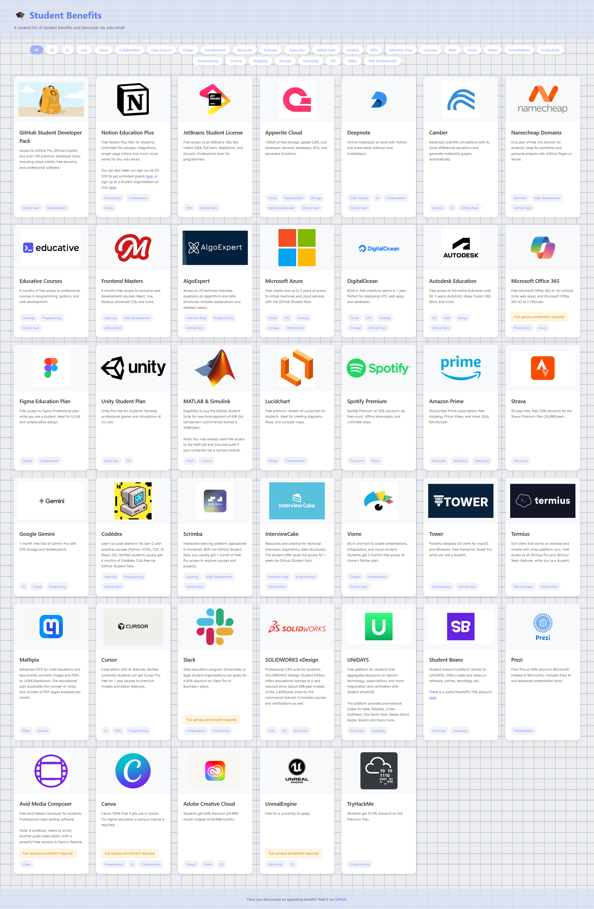

# 🎓 Student Benefits

A curated list of student benefits and discounts via .edu email. 

## Benefits as a website
Access it here: [studentbenefits.qzz.io](https://studentbenefits.qzz.io).


## Goal of this project

The goal is to fully feature all the interesting or appealing student benefits there are on the internet. Not only the ones from the GitHub Student Pack, but any education-related benefit provided by a company or organization.



> Screenshot of the initial list.

## Benefits as a list

<details>
<summary>List of Student Benefits</summary>

- GitHub Student Developer Pack
  - GitHub Copilot Pro
  - JetBrains IDEs
  - AppWrite Pro
  - Camber Cloud
  - Namecheap .me domain
  - Educative, Frontend Masters, Codedex, Scrimba
  - ...
- Notion Education Plus
- Figma Pro
- AutoDesk Suite
- Cursor Pro
- GitHub Copilot Pro
- Office 365
- ... (pending)
</details>

## Adding New Benefits

Do you know a benefit that is missing in the list? Open a GitHub issue or simply edit `benefits.json` and make a pull request. Each benefit has the following structure:

```json
{
  "title": "Service Name",
  "description": "Description of the student benefit",
  "imageSrc": "URL to the service logo/image",
  "tags": ["Category1", "Category2"]
}
```

The `description` property is the only one allowed to contain HTML elements (like `<br>`, `<a href='https://example.com'>example.com</a>`, `<strong>important</strong>` or similar).

The `imageSrc` can be an external link, but for speed performance it's better if it is a local relative path. You can download the logo or image locally and use [optimize-image.py](/assets/optimization-script/) to convert it to a 350px wide WEBP image (optimized version). Then put the optimized image in the benefits folder.

An additional boolean key `campusRequired` can be set to `false` for indicating that enrollment can't be done directly by the student (it needs to be done either by a professor or by the whole university or campus).

## About this site code
The front-end was initially very simple, simple GH pages site, images fetched from the internet, etc. Check: [fba6e4a66c633b7172dffc9949e4ec2f6ccb1da4](https://github.com/Mapaor/student-benefits/tree/fba6e4a66c633b7172dffc9949e4ec2f6ccb1da4).

Then basic SEO optimizations were made, robots.txt, sitemap.xml and JSON-LD were added and images were optimized and locally stored, see: [1d16bf4dc86f95500f9bedf90514e42d775270a5](https://github.com/Mapaor/student-benefits/tree/1d16bf4dc86f95500f9bedf90514e42d775270a5).

Then SEO performance was not great, so for enabling cache headers migrated from GH Pages to Vercel, see: [a49408ce2874d49f316dd748732e365f6b003f4d](https://github.com/Mapaor/student-benefits/tree/a49408ce2874d49f316dd748732e365f6b003f4d).

And finally modified some styling and script loading to improve LCP (Largest Content Paint) and CLS (Content Layout Shift) scores.

<details>
<summary>Current SEO status</summary>


</details>

## License

MIT License. See [LICENSE](LICENSE) file for details.
